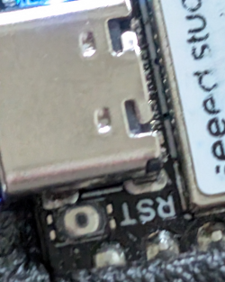
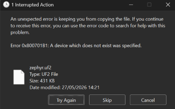

# SmartBridge

A project to enable Bosch ebikes to send power data to Garmin devices via an Android phone and nRF52840 board.

[](https://ko-fi.com/nilogax)


## Overview

Like many other Bosch ebike owners I was disappointed that the ebike didn't link to my Garmin, this project addresses that.  It needs a small amount of extra hardware (total cost in the UK from around £30-£40) but there is minimal (if any) soldering and full instructions are provided below.

The SmartBridge Android app reads rider power, motor power, cadence, battery level and assist mode from the bike.  Data is then sent to the nRF52840 board running the SmartBridge firmware which acts as a bridge to send the data on to the Garmin by emulating a power sensor over both Bluetooth and ANT+ and a LEV (ebike) over ANT+.

The standard power sensor protocol for both Bluetooth and ANT+ doesn't allow both rider and motor power to be sent so it sends the rider power as the 'Power' level and uses the left/right balance field to show the relative contribution of rider and motor.  The LEV (ebike) sensor includes the bike's battery level, the current assist mode, the bike's speed and distance covered as well as an estimate of the remaining battery range.  Bike battery status alerts can also be sent as phone notifications at configurable intervals.

It *should* be compatible with any Bosch Smart System ebike as they all use the same displays, so it makes sense that they use the same communications protocol.  It *might* work on other Bosch ebikes but that's untested as yet and would need someone to supply appropriate logs to decode.  Similarly other GPS units will likely use the standard power sensor protocols so this *should* work with them too, but that's also untested.

This is still very much a beta project.  I welcome feedback on how easy you found it to follow these instructions on building the solution, hardware sources in other countries, your success (or otherwise) with using it on other configurations or any issues you find in use.  There is an open [Feedback](https://github.com/Nilogax/SmartBridge/discussions/2) discussion topic here on Github or post to [this thread](https://www.emtbforums.com/threads/project-to-enable-bosch-garmin-integration.37793/) on the EMTB forum.

At present the list of known working configurations is:

- Phones: Pixel 8, Pixel 10 Pro, Nothing Phone 3
- Motors: SX and CX Gen 5
- Board: Seed XIAO nRF52840 Sense
- Device: Garmin Edge 830, Garmin Edge Explore 2, Garmin Epix 2 Pro, Garmin Edge 520, Garmin Venu 4

If your configuration isn't listed it may still work.  I'd suggest starting by just installing the Android app and making sure that it pairs with your bike and displays data whilst riding.  If that's successful then go on to get the bridge hardware and connect that with your device.

I'd strongly recommend subscribing to the [SmartBridge Updates](https://github.com/Nilogax/SmartBridge/discussions/1) discussion as well, so you stay informed about any development of this code.

If you've found SmartBridge useful
a coffee is always appreciated!

[](https://ko-fi.com/nilogax)

## Hardware

You will need:

- an nRF52840 board.  I have used a "Seeed XIAO nRF52840 Sense" board because it has a built in motion sensor so the board can power down when it's not being used without the need for a switch.  The Adafruit Feather nRF52840 Sense board should also support the code but the code would need some reconfiguration for things like LED behaviour and battery voltage calculation.

- a case.  My board came in a neat 35mm x 20mm padded screw top case which is perfect for my plan to carry it in my pack.  If you want to mount it to the bike then something more waterproof would be needed.

- a power source.  This can either be a battery (preferred) or power via the USB-C port.
    - Battery Option.  The nRF52840 is a low power device so you don't need a huge battery.  A 3.7V 150mAh LiPo battery should last for about 5-10 hours of riding and the Seeed board has a built in charging circuit so you can recharge the battery by plugging a USB-C power source into the board.  A larger capacity battery will obviously mean less recharging but make sure it will fit in your case.
    - USB-C Option.  You can also use the USB-C connection to power the board.  If using a power bank ensure that it doesn't have a low power cutoff.  The board draws very little power so some power banks will stop delivering power if this is below their minimum threshold.  An alternative would be to use reverse charging from your phone (though not all phones support this).  In either case make sure the board is still well protected from dust and moisture with only the USB-C port exposed.

- a way to connect the battery to the board (if using a battery).  If you are competent with a soldering iron then you can either solder the battery directly to the small rectangular tabs on the back of the board or (recommended) solder a JST 2.0 PH pigtail connector to the board and plug the battery into that. <br/>  <br/> Obviously make sure you use the same connector type that your battery has and that the polarity isn't changed by the connector (ie the red wire from the battery connects to the red wire to the board).  If you aren't happy with soldering small components then you could try your local phone/gadget repair shop as they should have everything needed to do the job.  Other options are the "Seeed XIAO Expansion Board" which includes a JST 2.0 battery connector and plugs straight onto the Sense board without any need for soldering (though I'm not sure how robust that connection is for use on a bike).

### Hardware Sources

#### UK

In the UK the Pi Hut is a good source:

Board:  https://thepihut.com/products/seeed-xiao-ble-nrf52840-sense?variant=53975181754753

It's probably worth getting the version with headers pre-soldered.  This is essential if you want to use the Expansion board, and even if not it makes the board a little easier to handle.

Battery: https://thepihut.com/products/150mah-3-7v-lipo-battery or https://www.ebay.co.uk/itm/376532634782 for a larger capacity with the same footprint.

Expansion board:  https://thepihut.com/products/seeeduino-xiao-expansion-board

Probably cheaper than buying a soldering iron if you don't have one.

JST 2.0 connectors are easily found online but make sure the wires are 26 or 28 SWG so they're easier to manage and connect to the board.

### Other countries

Please post to the [Feedback](https://github.com/Nilogax/SmartBridge/discussions/2) topic if you find a good source in another country so I can list it here.

## Software/Firmware

You will need both the Android app for your phone and the firmware to run on the board.  First clone this repository (or download it using the Download option under the green Code button).

### SmartBridge Android App

The easiest way to get this is to install the APK from the [latest release](https://github.com/Nilogax/SmartBridge/releases) onto your phone.  To do this you will need to enable the option to load APKs that aren't from Google Play - check the details of this for your phone.

Alternatively you can build it from the source code using Android Studio:

1. Download and install Android Studio from https://developer.android.com/studio  This may take some time.

1. In Android Studio use `File/Open` to a select the `/SmartBridge Android` folder in your cloned repository.  Android Studio will now scan the project folder and download all the resources needed.  This may take some time.  If Android Studio asks about updating/upgrading components then the safest option for an unfamiliar user is usually 'No'.

1. Enable Developer Options on your phone, this is usually done by navigating to `Settings/About phone` and tapping the `Build number` repeatedly.

1. Connect your phone to Android Studio.  This is usually done via WiFi - search for `Wireless debugging` in your phone's settings and enable this option, then choose `Pair device with pairing code`.  In Android Studio go to `Tools/Device Manager`, click the `Pair devices using WiFi` option, select `Pair using pairing code`.  After a short wait your phone should be listed on the screen as `Device at xyz.xyz.xyz.xyz`, click `Pair` then enter the code that's shown on your phone screen.

1. Build and install the SmartBridge app.  In Android Studio choose `Run/Run app`.  Android Studio will then build the SmartBridge app, install it on your phone and activate it.

### SmartBridge board firmware

1. If you do not want to use the ANT+ capabilities of the board you can download the `zephyr.uf2` file from the [latest release](https://github.com/Nilogax/SmartBridge/releases) onto your PC, then skip to the last two steps of this section to flash it onto the board.

1. To use ANT+ for this project you must register (free of charge) as an ANT Adopter to gain access to the ANT libraries for the board (the license prevents me from sharing them).  It can take a day or two for your account to be activated but check your junk mail folder as sometimes the messages end up in there.
    - Register for an account at https://www.thisisant.com/register/
    - After a short wait you should be approved as a basic user. Update your account to an ANT Adopter at https://www.thisisant.com/my-ant/
    - Link your ANT account to your Github account to gain access to the ANT libraries.  Select `Apply for Evaluation License` at the bottom of https://www.thisisant.com/developer/ant/nrf-connect-sdk/

1. Download and install Visual Studio Code (VSCode) from https://code.visualstudio.com/

1. In VSCode go to `View/Extensions` or `(Ctrl+Shift+X)`.  Search for the `nRF Connect for VS Code Extension Pack` and install it (make sure you select the Extension Pack rather than the simple nRF Connect extension as it includes some useful tools).

1. In VSCode open the nRF Connect extension by either clicking its logo in the left panel or `Ctrl+Alt+N`.  From the `WELCOME` panel select `Manage Toolchains/Install Toolchain` then select `v2.6.0` from the list.  This might take a few minutes to download.

1.  Next select `Manage SDKs/Install SDK/nRF Connect SDK` and again choose v2.6.0.  This might also take a few minutes to download.  Make sure there's plenty of free disk space to install this - around 10GB.  Keep a note of the folder that you install this in (eg `C:\Users\Nilogax\ncs\v2.6.0`) as you will need it in the next steps.

1. (Only needed for ANT+, and after you have completed the steps above).  Select `Open Terminal` at the bottom of the nRF Connect `WELCOME` panel.  Type the following:
    ```
    cd <SDK folder from previous step>
    west config manifest.group-filter -- "+ant"
    west update
    ```
    During the update you will need to login to your Github account to allow the system to download the ANT libraries.

1. (Only needed for ANT+).  Create a folder `xiao_ble_sense_s332` in `<SDK Folder>\zephyr\boards\arm` and copy the files from the repository's `xiao_ble_sense_s332` folder into it.

1. In the nRF Connect extension `WELCOME` panel select `Open an existing application` and open the `SmartBridge_Zephyr` folder from your cloned repository.

1. In the nRF Connect extension under `APPLICATIONS` select `Add build configuration`.  Click this then update the build configuration:
    * Ensure SDK and Toolchain versions are 2.6.0.  Ignore the warning about nrfjprog.
    * For the Bluetooth only version:
        * Under `boards` select `All` then type/select `xiao_ble_sense`
    * For the ANT+ and Bluetooth version:
        * Under `boards` select `All` then type/select `xiao_ble_sense_s332`
        * Under `Extra CMake arguments` click `Add argument` and type `-DCONF_FILE=prj_ant.conf`
    * Scroll to the bottom of the window.  Under `Build directory name` type either `build_ble` or `build_ant` as appropriate and click `Generate and Build`

1. During the build you may see warnings about `CONFIG_USB_DEVICE_PID` or `unused variable` for `err_code` - these can be ignored.  Once the build completes navigate to the build directory folder (`build_ble` or `build_ant`) under your project.  Open the `/zephyr` folder under that and find the executable file `zephyr.uf2`.

1. Double tap the tiny reset button by the board's USB socket (labelled RST in the picture below) on the Seeed board to put it into bootloader mode.  <br/>  <br/>Connect the board to your PC via a USB cable. The PC should recognise the board as a USB storage device and open the top level folder.

1. Copy the `zephyr.uf2` file from your PC onto the board (drag and drop).  As soon as the file is uploaded the board will restart and disconnect from the PC.  All being well it will show a solid green LED and a flashing blue LED.  Windows might show a file error with `Try Again/Skip/Cancel` options - this is just the result of the board restarting as soon as the file is copied and can be ignored (select `Cancel`).



## Usage

You'll need to configure your bike and bridge in the app before your first ride, and also add the power sensor to your Garmin.

### App usage


#### Bike connection

Before trying to use the app ensure that you have the Bosch Flow app installed and that it is paired with your bike.

When you first run the app it will request the permissions it needs to support Bluetooth and enable Notifications.  Accept these before continuing.

Turn on your bike and press the 'Pair Bike' button.  The app will show a list of devices, select your bike to connect the app.  If your bike doesn't appear you may need to place it in pairing mode - on the Smart System bikes this is done by pressing and holding the power button until the indicator flashes blue.  You should only need to pair your bike once, after that the app will auto-start in the background each time you turn on your bike.

Tapping the 'Forget Bike' button will un-pair your bike so you can connect to a different bike.  The app will only connect to one bike at a time.

#### Bridge connection

Make sure the bridge hardware is awake (see below) then press the 'Pair Bridge' button.  Select your bridge (`SmartBridge_xxxx`) to pair it.  Once the bridge is connected the app will show the current bridge battery level.  The app will reconnect to the paired bridge each time it runs.

Once the bridge is connected you will see a button to toggle between `Transport Mode` and `Ride Mode`.  In Ride Mode the bridge is fairly easy to wake by gentle movement, but in Transport Mode it will only be woken by a series of sharp taps (5 taps in 3 seconds).  Transport Mode is intended to prevent the bridge from waking during car journeys, flights etc so you don't need to unplug the battery.  In Ride Mode the bridge LED will be green, in Transport Mode it is red.

As with the bike, tapping "Forget Bridge" will un-pair the current bridge so you can switch to different hardware.

#### Data panel

The data panel shows the data being received from your bike.  If this doesn't update while you're riding then it's likely that your bike is sending a different message encoding to what the app recognises.

If that happens then you can capture a log which could assist with decoding your bike's messages.  Tap the "Start Logging" button and ride on, this will then save a 2 minute log of the data received from your bike in your phone's Downloads folder.  You'll get a notification when it's done.  After that please share the log file in the [Feedback](https://github.com/Nilogax/SmartBridge/discussions/2) discussion so I can try to extract the correct coding.  If no log file is produced that means there is even more work to decode the messages, but it may still be possible so post a discussion topic to get started.

The `Range History` slider allows you to control how much recent data is used to generate the estimated range remaining.  A higher figure uses a longer history, a shorter figure will only look at more recent data.  The range estimate is obtained by storing the distance travelled for each one percent battery drop, then extrapolating an estimated range from that based on the remaining battery level.  The estimate uses the lower bound of the 95% confidence interval of the mean `distance per percent` figures so it should be pessimistic, but it relies on consistent use of assistance modes and consistent terrain.  Connecting or disconnecting a Powermore battery will also lead to erroneous figures until the history has been overwritten.  The estimated range figure will likely differ from that shown in the Flow app or on a Kiox display.

You can also configure a notification threshold for bike battery updates.  This can be set to Off, 10% or 5% so for example at 5% it will send a phone notification at 95%, then 90% etc.

### Bridge usage


As mentioned above there are two operating modes for the bridge - Ride Mode and Transport Mode.  This determines how easy the bridge is to wake up.

Ride Mode is indicated by a green LED on the bridge and should wake with normal motion if you've got the bridge in your pack or on the bike - if not, a gentle shake should wake it up.

Transport Mode is indicated by a red LED on the bridge and it will then need repeated sharp taps to wake up.  As the name suggests the aim of Transport Mode is to prevent the bridge from waking while it's being transported and using the battery needlessly - something that SRAM AXS users may have experience of.

The bridge will power down after 3 minutes of 'zero' data from the bike (so no rider power, no motor power and no cadence).  No LEDs are lit when it is powered down.

The blue LED will flash if the bridge is trying to connect to the phone.  Once the phone is connected the blue LED will go out.

You can charge the battery by plugging in a USB-C lead.  A small green LED next to the USB socket will illuminate while it's charging.

If something stops working you can reboot the bridge by either disconnecting and reconnecting the battery or pressing the small reset button which is by the USB-C socket on the opposite side to the LEDs.

### Adding the power meter and LEV sensors to your Garmin

Once your bridge is powered up you should add it to your Garmin.  The procedure for this will depend on your particular GPS model.  If you're using ANT+ the power sensor will have a numerical ID, and the Bluetooth sensor will be called `SmartBridge_xxxx`.  The LEV sensor will show as an `Ebike` sensor with a numerical ID similar to the power sensor.  I'd recommend using the ANT+ option if you can.  Once you have connected the sensors you can add the data fields to your display in the usual way.

If you connect the LEV (Ebike) sensor then the speed and distance shown on your Garmin will be the values that are sent by the bike rather than from the Garmin's GPS tracking.  Experience suggests that the bike's distance measurement will be slightly higher than the GPS figure as the bike figure is based on wheel rotations so it captures your full track over the ground whereas GPS data is a sum of the straight line distance between each position recorded.

## Release History

Distributed under the GPL-2.0 license. See ``LICENSE`` for more information.

* 0.9.4 (11/6/2026)
    * Add ANT+ LEV sensor and associated data
    * Improve board's power consumption in sleep mode
* 0.9.3 (14/5/2026)
    * Change board code from Arduino to NCS
    * Add ANT+ power meter to board
    * Android app remains unchanged from 0.9.1
* 0.9.2 (3/5/2026)
    * Update Arduino sketch to improve BLE stability
    * No change to app from 0.9.1
* 0.9.1 (25/4/2026)
    * Corrected APK file
* 0.9.0 (25/4/2026)
    * First Beta release

## Acknowledgements

This project was inspired by the work that had already been done by [RobbyPee](https://github.com/RobbyPee/Bosch-Smart-System-Ebike-Garmin-Android).  That provided a great springboard to go on and develop the rest of this solution.
