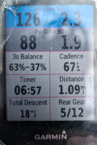
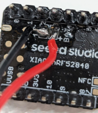
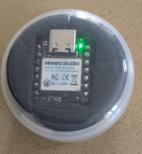

# SmartBridge

A project to enable Bosch ebikes to send power data to Garmin devices via an Android phone and nRF52840 board.

## Overview

Like many other Bosch ebike owners I was disappointed that the ebike didn't link to my Garmin, this project addresses that.  It needs a small amount of extra hardware (total cost in the UK from around £30-£40) but there is minimal (if any) soldering and full instructions are provided below.

The SmartBridge Android app reads rider power, motor power, cadence and battery level from the bike.  Power data and cadence is then sent to the nRF52840 board running the SmartBridge Anduino sketch which acts as a bridge to send the data on to the Garmin by emulating a Bluetooth power sensor.

The standard Bluetooth power sensor protocol doesn't allow both rider and motor power to be sent so it sends the rider power as the 'Power' level and uses the left/right balance field to show the relative contribution of rider and motor.  Bike battery alerts are sent as phone notifications at configurable intervals.

It *should* be compatible with any Bosch Smart System ebike as they all use the same displays, so it makes sense that they use the same communications protocol.  It *might* work on other Bosch ebikes but that's untested as yet.  Similarly other GPS units will likely use the standard Bluetooth protocols so this *should* work with them too, but that's also untested.

This is still very much a beta project.  I welcome feedback on how easy you found it to follow these instructions on building the solution, hardware sources in other countries, your success (or otherwise) with using it on other configurations or any issues you find in use.  There is an open [Feedback](https://github.com/Nilogax/SmartBridge/discussions/2) discussion topic here on Github or post to [this thread](https://www.emtbforums.com/threads/project-to-enable-bosch-garmin-integration.37793/) on the EMTB forum.

At present the list of known working configurations is:

- Bosch SX Motor, Pixel 8 phone, Seeed XIAO nRF52840 Sense, Garmin Edge 830

The Garmin Edge 520 will only pair with ANT+ sensors so aren't (yet) compatible. 

If your configuration isn't listed it may still work.  I'd suggest starting by just installing the Android app and making sure that it pairs with your bike and displays data whilst riding.  If that's successful then go on to get the bridge hardware and connect that with your device.

I'd strongly recommend subscribing to the [SmartBridge Updates](https://github.com/Nilogax/SmartBridge/discussions/1) discussion as well, so you stay informed about any development of this code.

If you have found SmartBridge useful then you can show your appreciation by buying me a coffee here:  

## Hardware

You will need:

- an nRF52840 board.  I used a "Seeed XIAO nRF52840 Sense" board because it has a built in motion sensor so the board can power down when it's not being used without the need for a switch.  The code *should* also run on the Adafruit Feather nRF52840 Sense but that is as yet untested - the Adafruit board has a battery connector installed as standard so might be an easier option for anyone who doesn't want to do any soldering.

- a case.  My board came in a neat 35mm x 20mm padded screw top case which is perfect for my plan to carry it in my pack.  If you want to mount it to the bike then something more waterproof would be needed.

- a battery.  The nRF52840 is a low power device so you don't need a huge battery.  A 3.7V 150mAh LiPo battery should last for about 5-10 hours of riding and the Seeed board has a built in charging circuit so you can recharge the battery by plugging a USB-C power source into the board.  A larger capacity battery will obviously mean less recharging but make sure it will fit in your case.

- a way to connect the battery to the board.  If you are competent with a soldering iron then you can either solder the battery directly to the small rectangular tabs on the back of the board or (recommended) solder a JST 2.0 PH pigtail connector to the board and plug the battery into that.      Obviously make sure you use the same connector type that your battery has and that the polarity isn't changed by the connector (ie the red wire from the battery connects to the red wire to the board).  If you aren't happy with soldering small components then you could try your local phone/gadget repair shop as they should have everything needed to do the job.  Other options are the "Seeed XIAO Expansion Board" which includes a JST 2.0 battery connector and plugs straight onto the Sense board without any need for soldering (though I'm not sure how robust that connection is for use on a bike), or of course the Adafruit board which has the battery connection built in.

### Hardware Sources

#### UK

In the UK the Pi Hut is a good source:

Board:  https://thepihut.com/products/seeed-xiao-ble-nrf52840-sense?variant=53975181754753

It's probably worth getting the version with headers pre-soldered.  This is essential if you want to use the Expansion board, and even if not it makes the board a little easier to handle.

Battery: https://thepihut.com/products/150mah-3-7v-lipo-battery or https://www.ebay.co.uk/itm/376532634782 for a larger capacity with the same footprint.

Expansion board:  https://thepihut.com/products/seeeduino-xiao-expansion-board

Probably cheaper than buying a soldering iron if you don't have one.

JST 2.0 connectors are easily found online but make sure the wires are 26 or 28 SWG so they're easier to manage and connect to the board.

### Other countries

Please post to the [Feedback](https://github.com/Nilogax/SmartBridge/discussions/2) topic if you find a good source in another country so I can list it here.

## Software/Firmware

You will need both the Android app for your phone and the Arduino sketch to run on the board.  First clone this repository (or download it using the Download option under the green Code button).

### SmartBridge Android App

The easiest way to get this is to install the APK from the [latest release](https://github.com/Nilogax/SmartBridge/releases) onto your phone.  To do this you will need to enable the option to load APKs that aren't from Google Play - check the details of this for your phone.

Alternatively you can build it from the source code using Android Studio:

1. Download and install Android Studio from https://developer.android.com/studio  This may take some time.

1. In Android Studio use `File/Open` to a select the `/SmartBridge Android` folder in your cloned repository.  Android Studio will now scan the project folder and download all the resources needed.  This may take some time.  If Android Studio asks about updating/upgrading components then the safest option for an unfamiliar user is usually 'No'.

1. Enable Developer Options on your phone, this is usually done by navigating to `Settings/About phone` and tapping the `Build number` repeatedly.

1. Connect your phone to Android Studio.  This is usually done via WiFi - search for `Wireless debugging` in your phone's settings and enable this option, then choose `Pair device with pairing code`.  In Android Studio go to `Tools/Device Manager`, click the `Pair devices using WiFi` option, select `Pair using pairing code`.  After a short wait your phone should be listed on the screen as `Device at xyz.xyz.xyz.xyz`, click `Pair` then enter the code that's shown on your phone screen.

1. Build and install the SmartBridge app.  In Android Studio choose `Run/Run app`.  Android Studio will then build the SmartBridge app, install it on your phone and activate it.

### SmartBridge Arduino sketch

1. Download and install the Arduino IDE from https://www.arduino.cc/en/software/

1. Add the Seeed board to the IDE.  Go to `File/Preferences`, scroll to the bottom and in `Additional boards manager URLs` add `https://files.seeedstudio.com/arduino/package_seeeduino_boards_index.json`, then click `OK`.

1. In the IDE go to `Tools/Boards manager` and search for `Seeed nRF52 Boards`.  Click `Install`.  Do not select `Seeed nRF52 mbed-enabled Boards`!

1. Next go to `Tools/Manage Libraries`, search for the `Seeed Arduino LSM6DS3` library and install it.  This is the library that supports the motion detector on the Seeed board.

1. In the Arduino IDE choose `File/New sketch` and create a sketch named `SmartBridge`.  The Arduino IDE will create a folder named `SmartBridge` and will create an empty `SmartBridge.ino` file in that folder.  Navigate to the `/SmartBridge Arduino` folder in your cloned repository and copy the `SmartBridge.ino` file from there into your new sketch, replacing the empty file that was created. Either copy the code and paste it into the empty file shown in the IDE or copy the whole `SmartBridge.ino` file into the folder for your new sketch.

1. Plug your board in to your PC/Laptop using a USB-C cable that supports data transfer.  The IDE should recognise the board as being connected.

1. Choose `Sketch/Upload` or `Ctrl+U`.  This will then compile the sketch and transfer it to your board.  If all is well once complete the board will have a steady green LED and a flashing blue LED.

## Usage

You'll need to configure your bike and bridge in the app before your first ride, and also add the power sensor to your Garmin.

### App usage

#### Bike connection

Before trying to use the app ensure that you have the Bosch Flow app installed and that it is paired with your bike.

When you first run the app it will request the permissions it needs to support Bluetooth and enable Notifications.  Accept these before continuing.

Turn on your bike and press the 'Pair Bike' button.  The app will show a list of devices, select your bike to connect the app.  If your bike doesn't appear you may need to place it in pairing mode - on the Smart System bikes this is done by pressing and holding the power button until the indicator flashes blue.  You should only need to pair your bike once, after that the app will auto-start in the background each time you turn on your bike.

Tapping the 'Forget Bike' button will un-pair your bike so you can connect to a different bike.  The app will only connect to one bike at a time.

#### Bridge connection

Make sure the bridge hardware is awake (see below) then press the 'Pair Bridge' button.  Select your bridge ("SmartBridge_xxxx") to pair it.  Once the bridge is connected the app will show the current bridge battery level.  The app will reconnect to the paired bridge each time it runs.

Once the bridge is connected you will see a button to toggle between "Transport Mode" and "Ride Mode".  In Ride Mode the bridge is fairly easy to wake by gentle movement, but in Transport Mode it will only be woken by a series of sharp taps (5 taps in 3 seconds).  Transport Mode is intended to prevent the bridge from waking during car journeys, flights etc so you don't need to unplug the battery.  In Ride Mode the bridge LED will be green, in Transport Mode it is Red.

As with the bike, tapping "Forget Bridge" will un-pair the current bridge so you can switch to different hardware.

#### Data panel

The data panel shows the data being received from your bike.  If this doesn't update while you're riding then it's likely that your bike is sending a different message encoding to what the app recognises.

If that happens then you can capture a log which could assist with decoding your bike's messages.  Tap the "Start Logging" button and ride on, this will then save a 2 minute log of the data received from your bike in your phone's Downloads folder.  You'll get a notification when it's done.  After that please share the log file in the [Feedback](https://github.com/Nilogax/SmartBridge/discussions/2) discussion so I can try to extract the correct coding.

You can also configure a notification threshold for bike battery updates.  This can be set to Off, 10% or 5% so for example at 5% it will send a phone notification at 95%, then 90% etc.

### Bridge usage

As mentioned above there are two operating modes for the bridge - Ride Mode and Transport Mode.  This determines how easy the bridge is to wake up.

Ride Mode is indicated by a green LED on the bridge and should wake with normal motion if you've got the bridge in your pack or on the bike - if not, a gentle shake should wake it up.

Transport Mode is indicated by a red LED on the bridge and it will then need repeated sharp taps to wake up.  As the name suggests the aim of Transport Mode is to prevent the bridge from waking while it's being transported and using the battery needlessly - something that SRAM AXS users may have experience of.

The bridge will power down after 3 minutes of 'zero' data from the bike (so no rider power, no motor power and no cadence).  No LEDs are lit when it is powered down.

The blue LED will flash if the bridge is trying to connect to either the phone or the Garmin.  Once both are connected the blue LED should go out.

You can charge the battery by plugging in a USB-C lead.  A small green LED next to the USB socket will illuminate while it's charging.

If something stops working you can reboot the bridge by either disconnecting and reconnecting the battery or pressing the small reset button which is by the USB-C socket on the opposite side to the LEDs.

### Adding the power meter sensor to your Garmin

Once your bridge is powered up you should add it to your Garmin.  The procedure for this will depend on your particular GPS model, but the sensor will be called `SmartBridge_xxxx`.  Once it's connected you can add the power, balance and cadence data fields to your display.

## Release History

Distributed under the GPL-2.0 license. See ``LICENSE`` for more information.

* 0.9.1 (25/4/2026)
    * Corrected APK file
* 0.9.0 (25/4/2026)
    * First Beta release

## Acknowledgements

This project was inspired by the work that had already been done by [RobbyPee](https://github.com/RobbyPee/Bosch-Smart-System-Ebike-Garmin-Android).  That provided a great springboard to go on and develop the rest of this solution.
